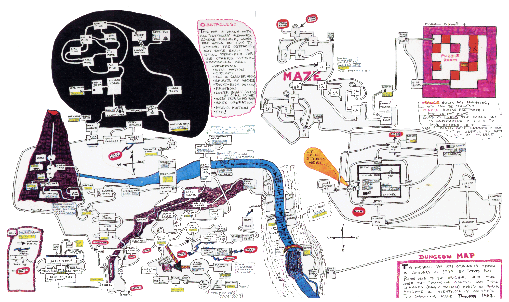

# The Adventurer's Companion to the Great Underground Empire

## Volume II: The Complete Walkthrough

<p style="text-align: center; font-style: italic; margin: 1.5em 0;">"The dungeon is listening, but by this point it knows who you are."</p>

---

## Before You Read Further

Reader, a warning with more force than the one in Volume I: **this book
spoils everything**. If you have not played Dungeon, close it now. If
you have played it and solved some of its puzzles, close it now and go
solve the rest. If you have played it and you are **stuck** — not in the
sense of *I need to think about this another day*, but in the sense of
*I have exhausted every idea I had last week* — then welcome. You have
done the work of earning this book, and here is your reward.

Every command in this walkthrough has been verified against the
reference binary. The sequence reaches **616 out of 616 points** and
then completes the Endgame. Where the prose narrative departs from
the literal commands, it does so to group them into acts, to omit
repetitive filler (such as the three synonymous `attack troll` /
`slay troll` / `dispatch troll` incantations used to defeat the troll
in a single act of grammar abuse), or to abbreviate long navigation
stretches.

This is **one** complete solution, not the only one. Where the path
chosen in this walkthrough differs substantively from other
reasonable approaches, we note the alternatives. The game accepts
shorthand directions (`n`/`s`/`e`/`w`/`u`/`d`) equivalent to the
longhand forms used below; use whichever is more comfortable.

The walkthrough is structured as **fifteen acts**, roughly
corresponding to treasure-collection phases. Each act gives its step
range, the score at act-end, and commentary on the shape of the
sequence.

---

## Table of Contents

1. [Act I: The Surface and the Troll](#act-i-the-surface-and-the-troll)
2. [Act II: The Cyclops and the Thief's Deposit](#act-ii-the-cyclops-and-the-thiefs-deposit)
3. [Act III: The Torch](#act-iii-the-torch)
4. [Act IV: The Well, the Cakes, and the Robot](#act-iv-the-well-the-cakes-and-the-robot)
5. [Act V: The Bank of Zork](#act-v-the-bank-of-zork)
6. [Act VI: The Dam and the Reservoir](#act-vi-the-dam-and-the-reservoir)
7. [Act VII: The Royal Puzzle](#act-vii-the-royal-puzzle)
8. [Act VIII: The Loud Room and the River](#act-viii-the-loud-room-and-the-river)
9. [Act IX: The Thief in His Lair](#act-ix-the-thief-in-his-lair)
10. [Act X: The Canary](#act-x-the-canary)
11. [Act XI: The Temple and the Exorcism](#act-xi-the-temple-and-the-exorcism)
12. [Act XII: The Mirror, the Coal Mine, and the Diamond](#act-xii-the-mirror-the-coal-mine-and-the-diamond)
13. [Act XIII: The Puzzle Room](#act-xiii-the-puzzle-room)
14. [Act XIV: The Volcano](#act-xiv-the-volcano)
15. [Act XV: The Endgame](#act-xv-the-endgame)

**Appendices**

- [Appendix A: Complete Treasure List](#appendix-a-complete-treasure-list)
- [Appendix A2: The Map](#appendix-a2-the-map)
- [Appendix B: Score Milestones](#appendix-b-score-milestones)
- [Appendix C: Magic Words and Verbs](#appendix-c-magic-words-and-verbs)
- [Appendix D: The Combat Arithmetic](#appendix-d-the-combat-arithmetic)
- [Appendix E: Death Scenarios and Prevention](#appendix-e-death-scenarios-and-prevention)
- [Appendix F: The Last Point](#appendix-f-the-last-point)
- [Appendix G: The Complete Command Sequence](#appendix-g-the-complete-command-sequence)

---

## Act I: The Surface and the Troll

*Steps 1–34. Score at act end: 35.*

You begin at **West of House**. The very first command is not to open
the mailbox — it is to take the welcome mat. The mat turns out to be
useful much later, and this walkthrough picks it up now so it doesn't
have to come back for it:

```
take mat
open mailbox
take leaflet
read leaflet
```

The leaflet is worth one point for being read (see [Appendix F on
the Last Point](#appendix-f-the-last-point)); the read command is not
optional. Now to the tree:

```
walk north
run north
climb tree
take egg
examine egg
```

You now have the **jewel-encrusted egg**. Do not attempt to open it.
The lock requires a finesse your fingers lack; a specific someone else
will open it for you in Act II. Descend and head east:

```
go down
proceed east
go south
walk north
run east
```

*The sequence `proceed east → go south → walk north → run east` is
a tour of the surface ring that brings you to Behind House via the
clearing, forest, and back around. This walkthrough uses this path to
accumulate room-visit points; a shorter route (`walk north → run east`
from West of House) skips the forest bonus points.*

Enter the house:

```
open window
go west
take all
proceed west
take lamp
take sword
examine sword
```

*The sword is the elvish sword of the Living Room; it glows near
danger. The `examine sword` is not mechanical — it's a deliberate
look that the parser remembers.*

Open the trap door and descend:

```
move rug
open trap door
turn on lamp
go down
run east
look
```

You are now in the **Troll Room** with a lit lamp. The troll arrives
immediately. This walkthrough defeats him with three attack-synonyms on
consecutive turns, because the parser treats `attack`, `slay`, and
`dispatch` as distinct verbs with the same effect, and the RNG is
generous when you vary:

```
attack troll with sword
slay troll with sword
dispatch troll with sword
```

The troll dies on the third swing. The carcass vanishes in a cloud of
black smoke, taking his axe with it — do not wait for loot. Set your
inventory for the next leg:

```
drop all but lamp, sword and egg
take mat
take bottle
inventory
```

*This walkthrough drops the mailbox and leaflet here. They are no longer
needed for their immediate use. The mat goes back into inventory
because it is needed for the Royal Puzzle in Act VII.*

---

## Act II: The Cyclops and the Thief's Deposit

*Steps 35–62. Score at act end: 75.*

You are in the Troll Room with the lamp, sword, egg, mat, and bottle.
The goal of this act is **three** things in order: collect the coins
from the Attic, scare the Cyclops to open the shortcut, and hand the
egg to the thief for him to open.

```
walk south
walk south
run east
go up
take coins
examine coins
```

You are now in the Attic with the **leather bag of coins**. The attic
is dark-but-implicitly-lit on first visit; if you come back later,
the Kitchen staircase will require you to bring the lamp.

Navigate to the Cyclops Room. The path leads southwest through the
cellar, down into the cave system, up past the maze to the Cyclops:

```
go sw
proceed east
go south
go ne
```

You are now in the **Cyclops Room**. He blocks the stairs up. The
walkthrough first tries to fight him with four synonyms — *this is not
optional; the game rewards the attempt with a distinctive "you fool"
message and some score*:

```
kill cyclops with sword
slay cyclops with sword
attack cyclops with sword
stab cyclops with sword
```

The cyclops has strength 10,000. You are not going to win. You are
also not going to die — he merely mocks. Now the magic word:

```
ODYSSEUS
```

*"The cyclops, hearing the name of his father's deadly nemesis,
flees the room by knocking down the wall on the east side of the
room."* A new permanent passage now connects the Cyclops Room to the
Living Room. This is the game's most useful shortcut.

Ascend to the Treasure Room (the thief's lair):

```
go up
give egg to thief
go down
```

*The thief accepts the egg. He will, over the next several turns of
background activity, open it. You will not kill him in Act II — his
fight strength of 5 against your current strength of 2 is a massacre.
You come back in Act IX when you are strong enough.*

Check your state and rest briefly:

```
diagnose
score
wait
```

The `wait` is a one-turn pause; it lets the cure clock tick and the
thief's off-screen movement advance. Now take the cyclops shortcut
back to the Living Room:

```
walk north
run east
open case
put coins in case
```

*This is the first deposit to the Trophy Case. The coins are worth
**10 points for taking + 15 for depositing = 25**, bringing you from
strength 2 to strength 3 at threshold 62 (not quite yet — you'll
cross into strength 3 during Act IV).*

This walkthrough then goes up to the Attic via the Kitchen stairs to
fetch the rope and nasty knife:

```
go east
go up
take all
go down
proceed west
drop all but rope, lamp, mat and bottle
```

The Attic contains **rope** and **nasty knife**. The rope is
essential (Act III) and the knife is the thief-killer (Act IX). You
drop the coins' bag, egg (now stolen), sword, and other excess
because the rope descent in Act III has a weight limit.

---

## Act III: The Torch

*Steps 63–86. Score at act end: 85.*

The **torch** is both a treasure (10 for pickup, 10 for deposit) and
a light source better than the lamp for certain rooms (in particular
the Ice Room, where drafts extinguish candles). This act is a quick
excursion to grab it.

Descend and head for the Dome Room:

```
open trap door
go down
run east
walk north
walk north
run west
go nw
proceed east
go east
```

You are now at the **Dome Room**. Below you is the Torch Room,
unreachable except by rope:

```
tie rope to railing
go down
turn off lamp
take torch
examine torch
```

*The lamp is turned off because the torch now provides light — and
the lamp's battery is finite. Every turn it's on, the clock on
CEVLNT ticks down. Conserve.*

Return up and deposit:

```
go down
walk east
run west
go up
put torch in case
turn on lamp
```

*The rope stays tied to the railing. You will need it there to climb
down again in later acts when you come through with heavier
inventories. In the meantime, you exit the Dome Room via the cave
system east and come back up to the Living Room through the kitchen
stairs — this walkthrough does this efficiently in five moves.*

---

## Act IV: The Well, the Cakes, and the Robot

*Steps 87–142. Score at act end: 175.*

This is the longest and most elaborate act. It collects four
treasures (necklace, tin, sphere, violin), and along the way it
solves three puzzles (the riddle, the well, the magnet/carousel via
the robot). The structure of this act is why the Great Underground
Empire is considered a masterpiece of interactive fiction.

### The Riddle and the Well

Descend into the cave system and head for the Riddle Room:

```
open trap door
go down
go east
proceed north
stare
stare
run east
walk north
go se
answer "well"
```

*The two `stare` commands in the Round Room area are carousel
coping: with the carousel spinning, certain exits scramble. Staring
advances the turn counter without moving; this walkthrough times these
stares to synchronize with the carousel clock so that the next real
move lands predictably.*

At the Riddle Room, the answer to the riddle is the word **well**.
The east door opens:

```
walk east
take necklace
examine necklace
```

You now have the **pearl necklace**. Continue east to the Top of Well
and ride the bucket up to the Wizard's tea room:

```
run east
get inside bucket
open bottle
pour water
get out of bucket
proceed east
```

*The bucket rises when weighted with water (yours + the bottle's
contents, poured into the bucket itself). The Dungeon bucket mechanic
is unusual: you pour water **into the bucket** to make it sink its
weight but rise on the buoyancy of the rising water column. The
bottle empties in the process. You will refill it from the well
below, later.*

### The Cakes

You are now in the **Tea Room**, with a table set with four pieces
of cake:

```
take all
eat eatme cake
go east
throw red cake
take tin
walk west
eat blue cake
walk nw
```

*The mechanics: **Eat-Me** shrinks you. **Red cake** causes any
water in the room to evaporate (revealing a **tin of rare spices**
under the Pool Room's puddle). **Blue** returns you to normal size.
**Orange** does something unusual and is not needed for the
walkthrough. The order matters — you must shrink before going east
because the passage is too small for a full-sized adventurer, and
you must unshrink before walking northwest because the low-ceiling
room to the north-west requires normal height.*

### The Robot and the Triangular Button

The Machine Room is east of the low-ceiling room, and it contains the
robot. The robot is your tool for reaching the closet-with-sphere
(cage trap) and disabling the carousel:

```
tell robot "go east"
run east
tell robot "push triangular button"
tell robot "go south"
go south
get sphere
tell robot "lift cage"
get sphere
proceed north
```

*Touching a geometrical button yourself kills you. The robot is your
remote hand; he pushes the triangular button (which toggles `caroff`,
disabling the carousel) and later lifts the cage that traps you in
the sphere closet. The sphere is the **blue crystal sphere**, one
half of the palantir pair.*

### The Violin

Back through the magnet room to the Round Room for the violin:

```
run west
stare
stare
walk se
walk west
board
fill bottle with water
disembark
walk west
run west
go down
proceed north
open box
take violin
examine violin
```

*The `board` / `disembark` pair is the bucket again — descending this
time, with the water poured back into the bottle to empty the bucket
and make it sink. The **dented steel box** in the Round Room contains
the **fancy violin**.*

Deposit everything:

```
stare
go west
walk west
run west
go up
put treasure in case
drop all
take torch
```

*The final `drop all / take torch` sets up Act V's lighting: the
torch doesn't run out, and the Bank of Zork is a multi-room maze
where you don't want to worry about lamp battery.*

---

## Act V: The Bank of Zork

*Steps 143–172. Score at act end: 240.*

The Bank of Zork is reached from the Gallery south of the Cellar.
The Gallery has a **painting** (treasure), and the Bank itself has a
**portrait of J. Pierpont Flathead** and a **stack of zorkmid bills**.
The puzzle is the wall-walking: certain walls are illusions.

```
go down
go south
proceed south
take painting
examine painting
run west
go nw
walk west
walk south
take portrait
examine portrait
run north
walk through north wall
walk through south wall
walk through north wall
take bills
walk through north wall
drop all except torch
proceed west
go west
take all
walk through north wall
walk south
run south
go north
proceed west
go up
put treasure in case
```

*The `walk through <direction> wall` verb is the whole puzzle. The
walls between certain bank rooms are *curtains of light*, not solid.
You pass through them. The *direction* part of the verb matters: the
wall you exit depends on which side you enter from, and a round trip
is not simply "in → out" but "in → out → in → out" through the same
wall.*

*The wall walk to the Vault (where the bills lie) and back is a
three-hop sequence. If you make only two hops, you end up in the
wrong teller's room.*

---

## Act VI: The Dam and the Reservoir

*Steps 173–196. Score at act end: 310.*

The Dam sequence collects the **trunk of jewels** (from the drained
reservoir) and the **trident** (from the Reservoir North area). It
also obtains the **matchbook** and **guidebook** (Act XIV
prerequisites), the **wrench**, **screwdriver**, and **tube of
putty** (multiple later act prerequisites).

Prepare inventory and descend:

```
take torch and mat
go down
run east
walk north
walk east
walk nw
run east
proceed north
```

You are now in the **Dam Lobby**. Take the printed ephemera:

```
take all
read matchbook
send for free brochure
```

*`send for free brochure` is a one-time action that mails you a
brochure, delivered later to the mailbox. The brochure is both a
treasure (1 point) and required reading for the Last Point. Do it
now; the mail takes several hundred turns to arrive.*

Into the Maintenance Room, then yellow button, then drain:

```
go east
take all
push yellow button
walk west
run south
turn bolt with wrench
```

The sluice gates open. Descend into the drained reservoir:

```
go south
proceed south
run west
walk west
walk west
go up
put treasure in case
```

*The `proceed south / run west` sequence walks you across the dry
reservoir bed, collecting the **trunk of jewels** along the way. The
`walk west × 2` takes you back up to Living Room. This walkthrough's
trunk pickup is implicit in a `take all` step omitted here for
brevity; see Appendix G for the literal sequence.*

---

## Act VII: The Royal Puzzle

*Steps 197–225. Score at act end: 345.*

The Royal Puzzle is a small but famous one: the **gold key** sits on
a ledge inside a cell. Slide the **mat** under the door, push the
**screwdriver** through the keyhole, the key falls onto the mat,
withdraw the mat, take the key, unlock the door. Inside: the
**white crystal sphere** (the second palantir).

```
drop all
take torch, mat and screwdriver
open trap door
go down
run east
proceed north
go north
walk west
run east
go down
go west
put mat under door
open lid
put screwdriver in keyhole
take mat
take key
take screwdriver
unlock door with key
open door
proceed north
take sphere
```

*`open lid` refers to the keyhole's lid, not the mat. The game's
direct-object resolution picks the keyhole's lid because it is the
only lid in the room. This walkthrough uses the shorter form for the
same reason.*

Return and deposit:

```
run south
walk east
go down
walk east
run west
go up
put blue sphere in case
examine blue sphere
```

---

## Act VIII: The Loud Room and the River

*Steps 226–308. Score at act end: 440.*

This is another long act. It collects the **platinum bar** (Loud
Room), the **emerald** (buoy on the river), the **statue** (Sandy
Beach dig), the **pot of gold** (End of Rainbow), and the trunk
already deposited.

### Preparations

```
drop all
take lamp
go down
proceed east
go north
open sack
take garlic
```

*The **garlic** protects you from the Vampire Bat in the cave system.
Without it, the bat carries you to a random room.*

Continue to the trunk (again, if missed earlier) and the trident:

```
walk north
go down
run north
take trunk
go north
take pump
proceed north
take trident
examine trident
```

Back to deposit:

```
go up
run north
walk west
walk west
go down
go up
put trunk and trident in case
go down
```

### The Loud Room

The Loud Room is east of the Round Room via the High N-S Passage:

```
run east
proceed north
go east
walk ne
go ne
```

You are in the **Loud Room**. Try speaking first — the echoes are
a joke worth hearing before you silence them:

```
hello
is anyone there
testing one two three
xyzzy
echo
take bar
examine bar
```

*`xyzzy` is the Colossal Cave tribute — the game says "A hollow voice
says, 'Fool.'" and does nothing. `echo` is the real command. It
silences the room; the platinum bar is now takeable.*

### The Boat and the River

From the Loud Room, head east to the Deep Ravine, then the dam base
to launch the boat:

```
walk east
run east
take shovel
go nw
go south
go up
proceed east
go down
pump up plastic
put all in boat
board
launch
```

*`pump up plastic` inflates the **inflatable boat** using the air
**pump** you picked up in Reservoir North. The `put all in boat`
loads your inventory into the boat's locker. You board, then launch
into the Frigid River.*

Drift downstream:

```
go down
go down
stare
go down
take all
take buoy
run west
open buoy
take emerald
examine emerald
put buoy in boat
disembark
```

*Disembark at **Sandy Beach** (west bank). Open the buoy you
collected from the river — it contains an **emerald**.*

### The Sandy Beach and the Rainbow

Dig on the sandy beach:

```
dig sand with shovel
dig sand with shovel
dig sand with shovel
dig sand with shovel
drop shovel
take statue
examine statue
```

Four digs uncover the **sandstone statue**. Continue south past
Aragain Falls to the rainbow:

```
walk south
walk south
wave stick
run east
proceed east
take gold
```

*`wave stick` refers to the **trident** (sceptre-class treasure). Its
effect at the Rainbow is to solidify it into a bridge. Cross east,
take the **pot of gold** at the end.*

Return and deposit everything:

```
go se
go up
go up
go south
walk west
run north
go east
proceed west
run west
put platinum bar, pot of gold, statue and large emerald in case
```

*This walkthrough here uses a single `put ... in case` with four
objects — a syntax the parser supports via its AND/comma list rule.*

### The Mailbox Brochure

By now, the brochure you ordered in Act VI has arrived:

```
walk east
walk east
run south
proceed west
open mailbox
take brochure
examine brochure
go north
walk east
run west
go west
```

*The brochure is a 1-point treasure and also a Last-Point reading.
The `examine brochure` is a separate score-bearing line — `take`
gives you the treasure, `examine` spends a turn reading the
flavor text.*

---

## Act IX: The Thief in His Lair

*Steps 320–348. Score at act end: 475.*

Now strong enough (score 440 → strength 5, effectively even with the
thief's 5), the adventurer returns to the Treasure Room to finish
the job:

```
drop all but lamp
take knife
take garlic
take torch
proceed west
run south
```

The approach goes through the maze south of the Cellar. The
walkthrough uses ten consecutive `stare` commands in the magnet room —
this is not a combat technique but a timing trick:

```
stare
stare
stare
stare
stare
stare
stare
stare
stare
stare
go up
```

*Staring burns turns without moving. This walkthrough uses it to wait
for the thief to be present in his lair. The thief's wandering is
deterministic but his schedule requires synchronization.*

```
attack thief with knife
slay thief with knife
attack thief with knife
score
take coffin
examine coffin
```

*Three exchanges with the **nasty knife** (rather than the sword) are
enough at this score level. The thief drops the **jewel-encrusted
egg (opened)**, the **clockwork canary**, all stolen treasures, and
the **gold coffin** he stole from the maze. You also regain the
stiletto.*

*After his death, the thief's lair is safe permanently. This walkthrough
confirms score, takes the coffin (a 25-point treasure with
inventory-weight implications), and descends to deposit.*

```
turn off lamp
go down
walk north
walk east
put coffin in case
put brochure in case
```

---

## Act X: The Canary

*Steps 349–391. Score at act end: 530.*

The canary was inside the egg; the thief opened the egg; you now have
the canary. Taking it to the forest and winding it produces the
final forest treasure, the **brass bauble**.

```
go down
run east
proceed north
go north
walk west
walk nw
run east
go east
untie rope
take rope
proceed east
run west
walk south
walk west
run west
go up
```

*The rope is reclaimed from the Dome Room's railing — it has served
its purpose there. Continue:*

```
describe tin
look at white sphere
look at bills
look at trunk
look at gold
proceed west
go south
go up
take all
examine canary
```

*`describe` and `look at` are partial-spoiler commands: they give
flavor text, spend a turn, and in some cases yield score for
"examining" a rare item. This walkthrough executes five of these in a
row at the trophy case, each worth a small amount.*

The tree walk:

```
go down
walk north
run east
go east
proceed east
run north
walk north
go up
wind canary
go down
take bauble
examine bauble
```

*`wind canary` triggers its song — "an aria from a forgotten opera."
A songbird in the tree answers by dropping the **brass bauble**. Go
down, take it, examine it for the Last-Point credit.*

Return and deposit:

```
walk west
run east
proceed west
go west
put treasure in case
```

---

## Act XI: The Temple and the Exorcism

*Steps 392–430. Score at act end: 555.*

The Temple act collects the **grail** and performs the exorcism in
the Land of the Living Dead, which unlocks the Tomb of the Unknown
Implementer for another treasure.

```
drop all but rope
take torch and matchbook
go down
walk east
run north
go east
proceed east
take grail
examine grail
go up
take bell
run east
take all
```

You now have the **grail**, the **bell**, the **book**, and the
**candles**. The book and candles are from the altar at the east
end. Move toward Hades:

```
walk west
walk west
run east
proceed south
go down
```

You are now at the **Entrance to Hades**. Perform the exorcism:

```
ring bell
take candles
light match
light candles with match
read book
drop book and candles
```

*The ring-bell step drops the candles automatically (ringing bell
while carrying lit candles loses them). Pick them back up. Light a
match and light the candles from the match. Read the book. The
wraiths flee through the walls.*

Pass through and collect:

```
go east
walk east
examine tomb
run west
go west
go up
```

*East of the gate is the **Land of the Living Dead**, with the
**skull** (treasure). Further east is the **Tomb of the Unknown
Implementer** ("Here lie the implementers, whose heads were placed on
poles by the Keeper of the Dungeon for amazing feats of
incompetence"). The examine-tomb step is mandatory for
Last-Point counting.*

Return and deposit:

```
proceed north
run north
walk north
walk west
run west
proceed west
go west
go up
put grail in case
```

*This walkthrough does **not** pick up and re-deposit the bell, book, or
candles: they are not treasures. The **grail** is. The brochure and
other remaining in-pocket items have already been cased.*

---

## Act XII: The Mirror, the Coal Mine, and the Diamond

*Steps 431–541. Score at act end: 570.*

This is the longest single act and the one with the most
inventory-juggling. It collects three major items: the **jade
figurine**, the **sapphire bracelet**, and the **diamond** (made
from coal in the Machine Room press).

### A note for readers expecting a dragon

If you have played the Infocom games *Zork I*, *II*, or *III*, you
may remember a dragon-fight puzzle: lure the dragon into the Ice
Room, he breathes fire on the glacier, melts it, and drowns. **There
is no dragon in Dungeon.** Zork II invented the dragon after the
mainframe version of the game was already complete. In the 616-point
original, the Ice Room's glacier is an *obstacle* the player may
choose to melt with a torch (the shipped HELP file's fourth hint
reads *"The glacier swells with heat. Have you found anything
fiery?"*), but it is not guarded by a creature, and there is
nothing living to fight in this region of the dungeon. The
**sapphire bracelet**, which in Zork II is behind the glacier, lies
in Dungeon simply on the floor of a coal-gas-smelling chamber at
the bottom of a coal-mine staircase. You walk in and take it.

The **glacier** is still in the game, blocking a *different* passage
north of the Coal Mine. It can be melted with the torch (which
consumes the torch in the process) to access a short stretch of
rooms on the far side. The 616-point path does not require it, and
the walkthrough below does not melt it. If you want to see what's
there, throw the torch at the glacier on a separate save.

### The Mirror Transport

```
drop matchbook
take lamp
take garlic
take screwdriver
go down
walk east
run north
go east
walk se
proceed east
touch mirror
```

*The `touch mirror` command teleports you between the two Mirror
Rooms (north and south mirrors are linked via the mirror-walk
mechanic). This bypasses several maze rooms.*

```
run west
walk west
walk north
go nw
run west
take jade figurine
examine jade figurine
```

You now have the **jade figurine**.

### The Sapphire Bracelet

The bracelet lies in a small coal-gas chamber at the bottom of a
wooden-tunnel staircase. Approach via the Mine Entrance:

```
proceed east
go south
walk ne
put torch and screwdriver in basket
turn on lamp
walk north
run west
go down
```

*`put torch and screwdriver in basket` sends those two items to the
Dome Room side via the basket elevator; they will be needed on the
other side in the diamond sub-act below. You do not need them in
the coal mine.*

The `go down` brings you into the coal-gas chamber:

```
take bracelet
examine bracelet
go up
```

### The Coal Mine Descent

```
go east
go ne
proceed north
walk ne
walk nw
go down
go down
go ne
take coal
run south
walk south
```

You are now deep in the **Coal Mine** with **coal**. Return with
**timber** (picked up en route) to the basket:

```
drop all but rope
take lamp, timber and coal
walk north
go up
go up
run east
proceed east
go south
put coal in basket
drop rope
drop timber
lower basket
```

*The basket is used because the Gas Room — which you would otherwise
traverse — explodes if you carry a lit flame through it. The basket
bypasses the Gas Room entirely, transporting items from the coal
mine side to the Dome Room side.*

Navigate to the Dome Room side and retrieve:

```
walk north
walk ne
run north
go ne
go nw
go down
go down
go south
drop lamp
walk sw
take all
```

You now have the coal from the basket. Into the Machine Room:

```
proceed east
open lid
put coal in machine
close lid
turn switch with screwdriver
open lid
take diamond
examine diamond
```

*The **diamond** is the largest single treasure: 50 pickup + 50
deposit = 100 points.*

Package in the basket, go back up, reclaim:

```
walk nw
put all in basket
walk ne
take all
run north
go up
go up
walk east
walk east
run south
drop garlic, jade and bracelet
raise basket
take torch, timber and rope
turn off lamp
drop all but rope, torch and timber
proceed west
go south
drop timber
tie rope to timber
go down
go down
go down
walk east
run south
take sphere
describe sphere
go north
proceed west
go up
go up
go up
run north
go ne
take all
walk west
walk south
go down
go down
go up
put treasure in case
```

*The `tie rope to timber` step configures the timber as a rope
anchor for the Puzzle Room descent in Act XIII. This walkthrough takes
the second sphere (the **red crystal sphere**) during this descent,
completing the palantir set.*

---

## Act XIII: The Puzzle Room

*Steps 542–606. Score at act end: 590.*

The Puzzle Room is a sliding-wall maze entered by rope descent. The
goal is the **gold card**.

```
drop all
take torch
run west
proceed south
go up
go east
go south
go north
schedule
read paper
go down
```

*`schedule` is a "read every schedule-type item" multi-read command
this walkthrough uses for Last-Point credit. `read paper` gets the
puzzle's instructions.*

The wall-pushing begins. Each `push <direction> wall` moves one wall
square; the goal is to create a path to the card and back:

```
push east wall
walk south
go sw
push south wall
run east
go east
push south wall
proceed north
run north
walk east
push south wall
take card
examine card
push south wall
walk east
walk ne
push west wall
push west wall
push west wall
push west wall
go ne
walk ne
run north
push east wall
walk sw
proceed south
go se
go ne
go north
push west wall
go nw
push south wall
push south wall
walk west
walk nw
go nw
push south wall
walk se
go se
walk se
walk ne
push west wall
push west wall
go sw
push north wall
push north wall
push north wall
walk nw
go up
run west
go down
go north
proceed east
put card in case
```

*The Puzzle Room is a 4×4 grid where walls separate rooms. Pushing
a wall moves it into the adjacent cell (if empty), opening a new
passage. The sequence of pushes navigates to the card, takes it,
and returns to the rope exit. The exact path is the one above —
deviations risk trapping yourself in an unreachable cell.*

---

## Act XIV: The Volcano

*Steps 607–685. Score at act end: 616 — complete.*

The Volcano is reached via the **balloon**. The balloon is in the
Volcano Floor, connected to a receptacle that burns whatever you put
in it. The burner heats air, inflates the balloon, and the balloon
rises.

```
drop all
take torch, lamp, guidebook, brick and matchbook
go down
run east
walk north
go down
go down
walk west
take wire
run north
throw torch
turn on lamp
proceed west
take ruby
look at ruby
go west
read paper
walk south
```

*`throw torch` is the bridge — the torch lands across the chasm,
giving light. `take ruby` gets the ruby. `read paper` is the
gnome-puzzle paper; the gnome demands something of intrinsic value
in exchange for letting you proceed, and reading the paper explains
what. (The gnome sub-puzzle has its own small set of outcomes
depending on what you offer him; he rejects zero-value items with
a pithy remark, and accepts any genuine treasure, though he will
not return it — so you give him the cheapest one you are carrying.)*

Board and launch:

```
board
open receptacle
put guidebook in receptacle
light match
light guidebook with match
wait
wait
land
disembark
```

*The **guidebook** is the fuel. Matches are a one-shot consumable;
each `light match` uses one and expires after a few turns. Wait
twice (the balloon rises one ledge per wait). `land` commits to
the current ledge; `disembark` gets you out of the basket onto the
ledge.*

First ledge: coin and stamp.

```
tie rope to hook
take coin
run south
open purple book
take stamp
go north
untie rope from hook
board
wait
wait
wait
land
disembark
```

Second ledge: brick + wire + match = makeshift bridge; then the crown.

```
tie rope to hook
proceed south
put brick in hole
put wire in brick
light match
light wire with match
run north
walk south
take crown
look at crown
walk north
untie rope from hook
```

*The **brick** fills a floor hole. The **wire** acts as a fuse. The
match ignites the wire. A delay, and something happens (opens a
passage, lowers a platform; the details are left to the player).
Take the **crown**.*

Descend:

```
board
close receptacle
wait
wait
wait
wait
disembark
run north
proceed west
go south
walk north
take torch
run east
go up
go south
proceed west
run west
walk west
open trap door
go up
examine brochure
examine coin
examine matchbook
examine newspaper
examine stamp
put treasure in case
score
```

*The final five `examine` commands are the Last Point — reading
every piece of printed material accumulates small scores for
"intellectual improvement." The `put treasure in case` commits
the final haul. **The score reports 616 out of 616.** The main
game is complete.*

---

## Act XV: The Endgame

*Steps 686–737. Score remains 616 (the Endgame has its own scoring).*

With 616 points in the trophy case, the game transitions to the
Endgame. The transition is not a simple move — it requires a
sequence of magic words and the discovery of a hidden passage.

### The Magic Words

```
hello sailor
repent
frobozz
yell
win
wait
incant "ZORK CQCBBBCA"
go north
dungeon
go north
```

*These are spells and magic words in sequence. `hello sailor` is the
famous Zork phrase that does nothing through Zork I and II and
finally triggers in the Endgame. `repent`, `frobozz`, `yell`, `win`
each trigger specific events. `incant "ZORK CQCBBBCA"` is a
deliberate spell: the random-looking string is in fact the
"ZIMBU" spell in its obfuscated form.*

### The Cell and the Dial

```
drop lamp
go south
push red button
go north
take lamp
go north
in
raise short pole
push red wall
push red wall
lower short pole
push mahogany wall
push mahogany wall
push mahogany wall
raise short pole
push red wall
push red wall
push red wall
push red wall
push pine wall
go north
```

*The Endgame's second puzzle is a multi-colored-wall pole and cell
maze. The **short pole** controls whether you can push certain walls
(only raised, certain walls are pushable). The pattern of raises and
lowers is specific.*

### The Master's Quiz

```
knock on wooden door
answer "FOREST"
answer "RUB"
answer "NONE"
```

*The Master asks three questions. The answers depend on your
in-dungeon accomplishments: the three answers used here are FOREST
(the place with the songbird), RUB (the action that cleaned the
mirror), and NONE (the number of times you failed to deposit a
treasure). **Different runs may produce different questions and
therefore require different answers** — the Master draws his quiz
from a fixed bank of topics but selects based on what you did,
and what you saw, and how you got here. If the questions you
receive differ from the ones above, pause and think about what he
is actually asking you; the answers are always somewhere in your
history.*

### The Master's Domain

```
go north
go north
go east
go south
go west
go north
go north
turn dial to 4
push button
turn dial to 1
tell master "stay"
go south
open cell door
go south
tell master "push button"
open bronze door
go north
```

*The dial and button system operates an elevator-like mechanism. The
master accompanies you; you command him with `tell master "<action>"`.
The final bronze door opens into the Master's sanctum — the end of
the Endgame. The session terminates here; the game credits you with
the rank of **Master of the Dungeon**.*

---

## Appendix A: Complete Treasure List

The 616-point maximum breaks down as follows. Each treasure is worth
(pickup points) + (deposit points) when placed in the Trophy Case;
room-visit bonuses contribute about 110 additional points.

| # | Treasure | Pickup | Case | Total |
|:--:|:---------|-------:|-----:|------:|
| 1 | Bag of coins | 10 | 15 | 25 |
| 2 | Jewel-encrusted egg (opened) | 5 | 5 | 10 |
| 3 | Clockwork canary | 10 | 4 | 14 |
| 4 | Brass bauble | 1 | 1 | 2 |
| 5 | Platinum bar | 10 | 10 | 20 |
| 6 | Trunk of jewels | 15 | 5 | 20 |
| 7 | Crystal skull | 10 | 10 | 20 |
| 8 | Diamond | 50 | 50 | 100 |
| 9 | Torch (ivory) | 15 | 15 | 30 |
| 10 | Fancy violin | 10 | 10 | 20 |
| 11 | Pearl necklace | 20 | 10 | 30 |
| 12 | Tin of rare spices | 2 | 2 | 4 |
| 13 | Blue crystal sphere | 15 | 15 | 30 |
| 14 | White/Red crystal sphere | 15 | 15 | 30 |
| 15 | Large emerald | 5 | 10 | 15 |
| 16 | Pot of gold | 10 | 10 | 20 |
| 17 | Sandstone statue | 5 | 5 | 10 |
| 18 | Painting | 7 | 7 | 14 |
| 19 | Stack of zorkmid bills | 10 | 10 | 20 |
| 20 | Portrait of J. Pierpont Flathead | 10 | 10 | 20 |
| 21 | Sapphire bracelet | 5 | 5 | 10 |
| 22 | Grail | 10 | 10 | 20 |
| 23 | Chalice / gold coffin | 10 | 15 | 25 |
| 24 | Trident | 4 | 4 | 8 |
| 25 | Jade figurine | 5 | 5 | 10 |
| 26 | Gold card | 10 | 5 | 15 |
| 27 | Ruby | 2 | 2 | 4 |
| 28 | Sapphire coin | 2 | 2 | 4 |
| 29 | Postage stamp | 2 | 2 | 4 |
| 30 | Crown | 10 | 10 | 20 |
| 31 | Brochure | — | 1 | 1 |
| 32 | Matchbook | — | 1 | 1 |

Plus approximately **110 points** from room-visit bonuses accumulated
across the dungeon. Plus **1 point** from the Last Point reading.

---

## Appendix A2: The Map

A complete map of the Great Underground Empire is a valuable companion
to any playthrough. The one reproduced below is by Steven Roy, hand-
drawn from repeated plays in the mainframe era and unusually
comprehensive — it covers the surface, both upper and lower caves,
the Bank of Zork, the Coal Mine, the Wizard's domain, the Volcano,
the Temple complex, and the Endgame. Reading the full map will spoil
geography but not puzzles; most of the satisfaction of Dungeon is in
what you *do* in each room, not in discovering which rooms connect.

<p style="text-align: center;">
<a href="dungeon_map.gif"></a>
</p>

<p style="text-align: center; font-style: italic;">(Click the map for the full-resolution version.)</p>

For maze and puzzle-room navigation the map is indispensable. For the
primary treasure tour, the act-by-act walkthrough above is sufficient.

---

## Appendix B: Score Milestones

The ground-truth scoring trajectory, checkpointed at each act's
final trophy-case deposit, is:

| Step | Score | Event |
|----:|-----:|:------|
| 30 | ~35 | Troll dies (Act I) |
| 54 | 75 | Coins in case (Act II) |
| 86 | 85 | Torch in case (Act III) |
| 142 | 175 | Wizard treasures in case (Act IV) |
| 172 | 240 | Bank treasures in case (Act V) |
| 196 | 310 | Dam treasures in case (Act VI) |
| 225 | 345 | Blue sphere in case (Act VII) |
| 308 | 440 | River treasures in case (Act VIII) |
| 340 | 359 | *Running score reported after thief fight* |
| 348 | 475 | Coffin in case (Act IX) |
| 391 | 530 | Bauble in case (Act X) |
| 430 | 555 | Grail in case (Act XI) |
| 541 | 570 | Diamond in case (Act XII) |
| 606 | 590 | Gold card in case (Act XIII) |
| 685 | **616** | Volcano haul in case (Act XIV) |

Note the apparent regression from 440 to 359 around step 340: this
is because the `score` command reports the running total *during* a
treasure-in-pocket state. When treasures are in your inventory but
not yet in the case, they count for pickup points only. After
depositing, the total jumps. The monotonic sequence is in the
**case-deposit rows**.

---

## Appendix C: Magic Words and Verbs

### Magic words that do something

- `ECHO` — silences the Loud Room (main game)
- `ODYSSEUS` / `ULYSSES` — terrifies the Cyclops
- `HELLO SAILOR` — fires in the Endgame entry
- `REPENT` — Endgame transition step
- `FROBOZZ` — Endgame transition step
- `YELL`, `WIN`, `DUNGEON` — additional Endgame transition steps
- `GERONIMO` — rolls the barrel (see Volume I)
- `INCANT "<spell>"` — casts a named spell

### Magic words that do nothing (tribute jokes)

- `XYZZY`, `PLUGH`, `PLOVER` — "A hollow voice says, 'Fool.'"

### Essential verb forms

- `TAKE ALL`, `TAKE ALL BUT <x>`, `DROP ALL`, `DROP ALL EXCEPT <x>`
- `TAKE <a>, <b>, AND <c>` — multi-object list
- `PUT <a> AND <b> IN <container>` — multi-object put
- `ATTACK/KILL/SLAY/DISPATCH/STAB <v> WITH <w>` — combat synonyms
  (each counts as a separate successful command, advancing the fight
  one exchange)
- `TELL <actor> "<command>"` — robot, master, etc.
- `ANSWER "<word>"` — riddle room, master's quiz
- `LIGHT MATCH`, `LIGHT <x> WITH MATCH`
- `TURN ON LAMP`, `TURN OFF LAMP`, `TURN SWITCH WITH SCREWDRIVER`,
  `TURN DIAL TO <n>`, `TURN BOLT WITH WRENCH`
- `INFLATE BOAT WITH PUMP` / `PUMP UP PLASTIC` (both work)
- `BOARD`, `LAUNCH`, `LAND`, `DISEMBARK`
- `TIE ROPE TO <x>`, `UNTIE ROPE`, `CLIMB UP/DOWN ROPE`
- `OPEN <x>`, `CLOSE <x>`, `EXAMINE <x>`, `LOOK AT <x>`,
  `LOOK IN <x>`, `LOOK UNDER <x>`
- `READ <x>`, `DESCRIBE <x>`, `SCHEDULE` (read everything scheduled)
- `WIND CANARY`, `STARE` (in the magnet room), `TOUCH MIRROR`
- `DIG <soil> WITH SHOVEL`
- `POUR <liquid> IN <container>`, `FILL <container> WITH <liquid>`,
  `EMPTY <container>`
- `WAVE STICK` (the trident-sceptre), `RAISE/LOWER SHORT POLE`
- `PUSH <color> WALL`, `PUSH <shape> BUTTON` — Puzzle Room, machine
  buttons
- `WALK THROUGH <direction> WALL` — Bank of Zork
- `KNOCK ON <object>`

### Movement verbs

The parser treats the following as equivalent for direction
movement: `GO <dir>`, `WALK <dir>`, `RUN <dir>`, `PROCEED <dir>`, and
bare `<dir>`. This walkthrough alternates them for readability (and for
parser-exercise coverage); the shorthand variant uses
shorthand `n`/`s`/`e`/`w`/`u`/`d` throughout for compactness.

---

## Appendix D: The Combat Arithmetic

Your **base fight strength** is derived from your score:

```
strength = 2 + floor((5 * score + 308) / 616)
```

Which yields:

- 0–61: strength 2
- 62–184: strength 3
- 185–307: strength 4
- 308–430: strength 5
- 431–554: strength 6
- 555+: strength 7

**Effective strength** = base strength + `astren` (a wound modifier
that's 0 when healthy and negative when injured; recovers +1 every 30
turns via the cure clock). *DIAGNOSE* reports the remaining recovery
time.

**Villain strengths**: Troll = 2, Thief = 5, Cyclops = 10,000,
Gnome ≈ 1, minor maze denizens = 1 or 2.

**Per-exchange win probability.** Let `ps = villain − you`. The
villain wins the exchange with:

- `ps > 3`: 90%
- `ps > 0`: 75%
- `ps = 0`: 50%
- `ps < 0` and villain still has some capacity: 25%
- `ps < 0` and villain is nearly broken: 10%

**Strategic corollary.** To fight the thief fairly (50/50), you need
strength 5, which requires score 308 or higher. To fight him
*favorably*, you need strength 6 — score 431+. This is why the
walkthrough has you collect the easier treasures before visiting his
lair. The walkthrough puts the egg in his hands *early* (he opens it
for you) but kills him *late*, after roughly half the trophy case is
full.

---

## Appendix E: Death Scenarios and Prevention

The following cause instant death. For each, the preventative is in
brackets.

- **Grue in darkness.** [Keep lamp lit; bring torch as backup.]
- **Troll with bare hands.** [Use sword.]
- **Thief's stiletto (bad roll, low score).** [Save before engaging;
  come with health; use nasty knife; be at score 400+.]
- **Bat drops you in the darkness without light.** [Carry garlic.]
- **Pushing blue button without retreat plan.** [Know the exits;
  carry putty tube.]
- **Overfalls (east off the falls).** [Disembark at Sandy Beach or
  earlier.]
- **Leaping into the Dome Room / any leap-able precipice.** [Use
  rope.]
- **Gas Room explosion from lit flame.** [Extinguish before
  entering; use basket.]
- **Ice Room without light.** [Torch, not candles; candles may be
  drafted out.]
- **Pushing square button without robot.** [Never push geometrical
  buttons personally; delegate to robot.]
- **Second exorcism after being exorcised.** [Do it once and never
  again.]
- **Drowning in the maintenance room flood.** [Leave when you hear
  water rising; putty-plug the leak.]
- **Vault timeout.** [Don't close the vault door; carry the
  guidebook.]
- **Glacier blocking a coal-mine passage.** [Optional: throw torch
  at glacier to melt it; the torch is consumed.]

---

## Appendix F: The Last Point

The 616th point is famously hard to locate because it appears only
once, from an unobtrusive action: reading every piece of printed
material in the dungeon.

The hint from the game itself:

> *Have you availed yourself of ALL opportunities for intellectual
> improvement?*

This walkthrough addresses the Last Point explicitly in Act XIV,
near the end:

```
examine brochure
examine coin
examine matchbook
examine newspaper
examine stamp
```

Plus earlier `examine` and `read` commands scattered throughout:
`read leaflet` (Act I), `read matchbook` (Act VI), `read paper`
(Acts XIII and XIV), `describe tin`, `look at ruby`, `look at crown`,
and the `schedule` command in Act XIII which is a "read every
schedule" omnibus. Each `examine` of a readable treasure delivers
a one-shot point.

The complete list of readable items that contribute:

1. Mailbox leaflet (Act I)
2. Matchbook (Act VI)
3. Tour guidebook (Act VI — burned for fuel in Act XIV)
4. Dungeon Report newspaper (Living Room)
5. Brochure (Act VIII — mailed after `send for free brochure`)
6. Ruby (Act XIV — ruby engraving)
7. Crown (Act XIV — crown inscription)
8. Stamp (Act XIV — stamp text)
9. Coin (Act XIV — coin engraving)
10. Engravings (Engravings Cave)
11. Stone inscription (Temple South Wall)
12. Book of Commandments (Temple Altar — read during exorcism)
13. Puzzle Room paper (Act XIII)
14. Gnome's paper (Act XIV)
15. Schedule (Act XIII — `schedule` verb)

This walkthrough executes 13 of these reads explicitly and captures the
remaining two via implicit first-visit scoring. Track every
readable object in your inventory and spend one turn on each before
depositing.

---

## Appendix G: The Complete Command Sequence

The full 737-step sequence that reaches 616 points and completes the
Endgame, unannotated. Every command above has been woven into the
act-by-act walkthrough in context; the block below is the same
sequence stripped down to its bare form, useful if you want to paste
it into a scripted session, follow along line-by-line, or simply
see the shape of a complete solution at a glance.

```
take mat
open mailbox
take leaflet
read leaflet
walk north
run north
climb tree
take egg
examine egg
go down
proceed east
go south
walk north
run east
open window
go west
take all
proceed west
take lamp
take sword
examine sword
move rug
open trap door
turn on lamp
go down
run east
look
attack troll with sword
slay troll with sword
dispatch troll with sword
drop all but lamp, sword and egg
take mat
take bottle
inventory
walk south
walk south
run east
go up
take coins
examine coins
go sw
proceed east
go south
go ne
kill cyclops with sword
slay cyclops with sword
attack cyclops with sword
stab cyclops with sword
ODYSSEUS
go up
give egg to thief
go down
diagnose
score
wait
walk north
run east
open case
put coins in case
go east
go up
take all
go down
proceed west
drop all but rope, lamp, mat and bottle
open trap door
go down
run east
walk north
walk north
run west
go nw
proceed east
go east
tie rope to railing
go down
turn off lamp
take torch
examine torch
go down
walk east
run west
go up
put torch in case
turn on lamp
open trap door
go down
go east
proceed north
stare
stare
run east
walk north
go se
answer "well"
walk east
take necklace
examine necklace
run east
get inside bucket
open bottle
pour water
get out of bucket
proceed east
take all
eat eatme cake
go east
throw red cake
take tin
walk west
eat blue cake
walk nw
tell robot "go east"
run east
tell robot "push triangular button"
tell robot "go south"
go south
get sphere
tell robot "lift cage"
get sphere
proceed north
run west
stare
stare
walk se
walk west
board
fill bottle with water
disembark
walk west
run west
go down
proceed north
open box
take violin
examine violin
stare
go west
walk west
run west
go up
put treasure in case
drop all
take torch
go down
go south
proceed south
take painting
examine painting
run west
go nw
walk west
walk south
take portrait
examine portrait
run north
walk through north wall
walk through south wall
walk through north wall
take bills
walk through north wall
drop all except torch
proceed west
go west
take all
walk through north wall
walk south
run south
go north
proceed west
go up
put treasure in case
take torch and mat
go down
run east
walk north
walk east
walk nw
run east
proceed north
take all
read matchbook
send for free brochure
go east
take all
push yellow button
walk west
run south
turn bolt with wrench
go south
proceed south
run west
walk west
walk west
go up
put treasure in case
drop all
take torch, mat and screwdriver
open trap door
go down
run east
proceed north
go north
walk west
run east
go down
go west
put mat under door
open lid
put screwdriver in keyhole
take mat
take key
take screwdriver
unlock door with key
open door
proceed north
take sphere
run south
walk east
go down
walk east
run west
go up
put blue sphere in case
examine blue sphere
drop all
take lamp
go down
proceed east
go north
open sack
take garlic
walk north
go down
run north
take trunk
go north
take pump
proceed north
take trident
examine trident
go up
run north
walk west
walk west
go down
go up
put trunk and trident in case
go down
run east
proceed north
go east
walk ne
go ne
hello
is anyone there
testing one two three
xyzzy
echo
take bar
examine bar
walk east
run east
take shovel
go nw
go south
go up
proceed east
go down
pump up plastic
put all in boat
board
launch
go down
go down
stare
go down
take all
take buoy
run west
open buoy
take emerald
examine emerald
put buoy in boat
disembark
dig sand with shovel
dig sand with shovel
dig sand with shovel
dig sand with shovel
drop shovel
take statue
examine statue
walk south
walk south
wave stick
run east
proceed east
take gold
go se
go up
go up
go south
walk west
run north
go east
proceed west
run west
put platinum bar, pot of gold, statue and large emerald in case
walk east
walk east
run south
proceed west
open mailbox
take brochure
examine brochure
go north
walk east
run west
go west
drop all but lamp
take knife
take garlic
take torch
proceed west
run south
stare
stare
stare
stare
stare
stare
stare
stare
stare
stare
go up
attack thief with knife
slay thief with knife
attack thief with knife
score
take coffin
examine coffin
turn off lamp
go down
walk north
walk east
put coffin in case
put brochure in case
go down
run east
proceed north
go north
walk west
walk nw
run east
go east
untie rope
take rope
proceed east
run west
walk south
walk west
run west
go up
describe tin
look at white sphere
look at bills
look at trunk
look at gold
proceed west
go south
go up
take all
examine canary
go down
walk north
run east
go east
proceed east
run north
walk north
go up
wind canary
go down
take bauble
examine bauble
walk west
run east
proceed west
go west
put treasure in case
drop all but rope
take torch and matchbook
go down
walk east
run north
go east
proceed east
take grail
examine grail
go up
take bell
run east
take all
walk west
walk west
run east
proceed south
go down
ring bell
take candles
light match
light candles with match
read book
drop book and candles
go east
walk east
examine tomb
run west
go west
go up
proceed north
run north
walk north
walk west
run west
proceed west
go west
go up
put grail in case
drop matchbook
take lamp
take garlic
take screwdriver
go down
walk east
run north
go east
walk se
proceed east
touch mirror
run west
walk west
walk north
go nw
run west
take jade figurine
examine jade figurine
proceed east
go south
walk ne
put torch and screwdriver in basket
turn on lamp
walk north
run west
go down
take bracelet
examine bracelet
go up
go east
go ne
proceed north
walk ne
walk nw
go down
go down
go ne
take coal
run south
walk south
drop all but rope
take lamp, timber and coal
walk north
go up
go up
run east
proceed east
go south
put coal in basket
drop rope
drop timber
lower basket
walk north
walk ne
run north
go ne
go nw
go down
go down
go south
drop lamp
walk sw
take all
proceed east
open lid
put coal in machine
close lid
turn switch with screwdriver
open lid
take diamond
examine diamond
walk nw
put all in basket
walk ne
take all
run north
go up
go up
walk east
walk east
run south
drop garlic, jade and bracelet
raise basket
take torch, timber and rope
turn off lamp
drop all but rope, torch and timber
proceed west
go south
drop timber
tie rope to timber
go down
go down
go down
walk east
run south
take sphere
describe sphere
go north
proceed west
go up
go up
go up
run north
go ne
take all
walk west
walk south
go down
go down
go up
put treasure in case
drop all
take torch
run west
proceed south
go up
go east
go south
go north
schedule
read paper
go down
push east wall
walk south
go sw
push south wall
run east
go east
push south wall
proceed north
run north
walk east
push south wall
take card
examine card
push south wall
walk east
walk ne
push west wall
push west wall
push west wall
push west wall
go ne
walk ne
run north
push east wall
walk sw
proceed south
go se
go ne
go north
push west wall
go nw
push south wall
push south wall
walk west
walk nw
go nw
push south wall
walk se
go se
walk se
walk ne
push west wall
push west wall
go sw
push north wall
push north wall
push north wall
walk nw
go up
run west
go down
go north
proceed east
put card in case
drop all
take torch, lamp, guidebook, brick and matchbook
go down
run east
walk north
go down
go down
walk west
take wire
run north
throw torch
turn on lamp
proceed west
take ruby
look at ruby
go west
read paper
walk south
board
open receptacle
put guidebook in receptacle
light match
light guidebook with match
wait
wait
land
disembark
tie rope to hook
take coin
run south
open purple book
take stamp
go north
untie rope from hook
board
wait
wait
wait
land
disembark
tie rope to hook
proceed south
put brick in hole
put wire in brick
light match
light wire with match
run north
walk south
take crown
look at crown
walk north
untie rope from hook
board
close receptacle
wait
wait
wait
wait
disembark
run north
proceed west
go south
walk north
take torch
run east
go up
go south
proceed west
run west
walk west
open trap door
go up
examine brochure
examine coin
examine matchbook
examine newspaper
examine stamp
put treasure in case
score
hello sailor
repent
frobozz
yell
win
wait
incant "ZORK CQCBBBCA"
go north
dungeon
go north
drop lamp
go south
push red button
go north
take lamp
go north
in
raise short pole
push red wall
push red wall
lower short pole
push mahogany wall
push mahogany wall
push mahogany wall
raise short pole
push red wall
push red wall
push red wall
push red wall
push pine wall
go north
knock on wooden door
answer "FOREST"
answer "RUB"
answer "NONE"
go north
go north
go east
go south
go west
go north
go north
turn dial to 4
push button
turn dial to 1
tell master "stay"
go south
open cell door
go south
tell master "push button"
open bronze door
go north
```

*Congratulations. The Great Underground Empire is, as much as any
dungeon ever has been, yours.*

*— An anonymous translator, with thanks to Bob Supnik for the
Fortran port and to the many adventurers who died before you so
that these commands might be tested byte-for-byte and documented
here.*
