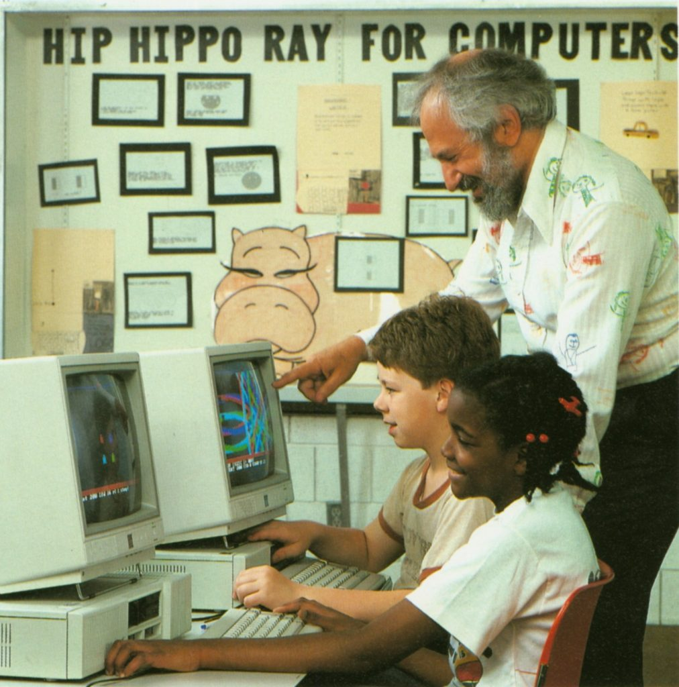

# About Logo

In 1966, [Seymour Papert](https://en.wikipedia.org/wiki/Seymour_Papert) had an idea that would change what computers were for.

Papert was a mathematician who had spent five years studying with [Jean Piaget](https://en.wikipedia.org/wiki/Jean_Piaget) in Geneva before joining [Marvin Minsky](https://en.wikipedia.org/wiki/Marvin_Minsky) at the [MIT Artificial Intelligence Laboratory](https://en.wikipedia.org/wiki/MIT_Computer_Science_and_Artificial_Intelligence_Laboratory). He knew how children learn: not by being told, but by building. And he believed that computers, which at the time were reserved for scientists and engineers, could give children something genuinely new to build with.

The programming languages of the 1960s were designed for adults solving adult problems. Papert, working with [Wally Feurzeig](https://en.wikipedia.org/wiki/Wally_Feurzeig) and [Cynthia Solomon](https://en.wikipedia.org/wiki/Cynthia_Solomon) at Bolt, Beranek and Newman in Cambridge, Massachusetts, set out to create the first programming language designed for children. They called it Logo, from the Greek *logos*: word, thought, reason. The first version was running by 1967, implemented in Lisp on a timeshared PDP-1. Its first students were sixth and seventh graders at Hanscom Field School in Lincoln, Massachusetts, just a few miles from the lab.

The original Logo had no turtle. It was a language for playing with words, sentences, and numbers: a child-sized Lisp. The turtle came later, arriving around 1970-71 at MIT. The first turtles were physical robots: dome-shaped machines that sat on the floor, connected to the computer by a cable, carrying a pen. Children would type commands and the robot would draw. FORWARD 100. RIGHT 90. FORWARD 100. The idea was "body-syntonic reasoning": you could understand what the turtle would do by imagining yourself as the turtle, walking forward, turning right. The geometry was not abstract. It was yours.



By the mid-1970s the turtle had migrated from the floor to the screen, and from the research lab toward the wider world. But Logo was still confined to expensive institutional computers. What changed everything was the arrival of personal computers: the Apple II in 1977, the TI 99/4, and the Atari 800. Suddenly the machines were cheap enough for classrooms. In 1980, Logo Computer Systems Inc. (LCSI) was formed to build commercial versions of Logo for these new machines. That same year, Papert published *[Mindstorms: Children, Computers, and Powerful Ideas](https://en.wikipedia.org/wiki/Mindstorms_(book))*, the book that became the manifesto of the movement.

*[Mindstorms](https://en.wikipedia.org/wiki/Mindstorms_(book))* argued that children should not use computers to be taught. They should use computers to *think*. The computer was not a delivery system for curriculum. It was a "Mathland": an environment where mathematical ideas could be encountered naturally, the way a child in France encounters French. The turtle was the entry point, but Logo was a real programming language with recursion, variables, and procedures. A child who started by drawing squares could end up reasoning about geometry, debugging logical errors, and building programs of genuine complexity. The word "debugging" itself, Papert observed, was a more honest and less punishing way to talk about learning from mistakes than anything the schools had come up with.

The timing was electric. Personal computers were flooding into schools, and teachers were desperate for something to do with them. Logo spread fast: Apple Logo, TI Logo, Atari Logo, Commodore Logo. By 1982, [BYTE magazine](https://archive.org/details/byte-magazine-1982-08) devoted an entire issue to Logo. Terrapin Software produced commercial turtle robots. Schools across the United States and the United Kingdom adopted Logo as a staple of computer education. In England it became part of the national curriculum.

## How to Program in Logo

Logo is a language you learn by doing. You type a command, the turtle moves, and you see what happens. Here is how it works.

### The Turtle

The turtle is a small arrow in the center of the screen. It has a position, a heading (the direction it faces), and a pen. When the pen is down, the turtle draws a line wherever it goes. When the pen is up, it moves without drawing.

`FORWARD 100` — move forward 100 steps

`BACK 50` — move backward 50 steps

`RIGHT 90` — turn right 90 degrees

`LEFT 45` — turn left 45 degrees

`PENUP` — lift the pen (stop drawing)

`PENDOWN` — put the pen down (start drawing)

`HOME` — go back to the center

`CLEARSCREEN` — clear the screen and go home

### Drawing Shapes

A square is four sides and four turns:

```
FORWARD 50
RIGHT 90
FORWARD 50
RIGHT 90
FORWARD 50
RIGHT 90
FORWARD 50
RIGHT 90
```

But typing the same thing four times is tedious. Logo has `REPEAT`:

```
REPEAT 4 [FORWARD 50 RIGHT 90]
```

Try changing the angle. A triangle:

```
REPEAT 3 [FORWARD 80 RIGHT 120]
```

A circle (really a 36-sided polygon):

```
REPEAT 36 [FORWARD 5 RIGHT 10]
```

A star:

```
REPEAT 5 [FORWARD 80 RIGHT 144]
```

A starburst:

```
REPEAT 36 [FORWARD 50 RIGHT 170]
```

### Defining Procedures

You can teach Logo new words. The command `TO` defines a new procedure:

```
TO SQUARE :SIZE
  REPEAT 4 [FORWARD :SIZE RIGHT 90]
END
```

Now `SQUARE 50` draws a small square, and `SQUARE 100` draws a big one. The `:SIZE` is a variable — it holds whatever number you pass in.

Use your new procedure to make patterns:

```
REPEAT 36 [SQUARE 50 RIGHT 10]
```

### Variables and Arithmetic

Variables start with a colon when you use them, and a quote when you name them:

```
MAKE "SIDE 60
FORWARD :SIDE
```

Logo does arithmetic with `+`, `-`, `*`, `/`:

```
PRINT 3 + 4
PRINT :SIDE * 2
```

### Recursion

A procedure can call itself. This is recursion, and it is Logo's most powerful idea.

A spiral:

```
TO SPIRAL :SIZE :ANGLE
  IF :SIZE > 100 [STOP]
  FORWARD :SIZE
  RIGHT :ANGLE
  SPIRAL :SIZE + 2 :ANGLE
END
SPIRAL 1 91
```

A tree:

```
TO TREE :SIZE
  IF :SIZE < 5 [STOP]
  FORWARD :SIZE
  LEFT 30
  TREE :SIZE * 0.7
  RIGHT 60
  TREE :SIZE * 0.7
  LEFT 30
  BACK :SIZE
END
CLEARSCREEN
PENUP BACK 60 PENDOWN
TREE 50
```

### Colors

The turtle can draw in different colors:

`SETPENCOLOR 0` — Black

`SETPENCOLOR 1` — White

`SETPENCOLOR 2` — Green

`SETPENCOLOR 3` — Violet

`SETPENCOLOR 4` — Orange

`SETPENCOLOR 5` — Blue

`SETPENCOLOR 6` — Cyan

`SETPENCOLOR 7` — Yellow

Try a colorful design:

```
REPEAT 8 [SETPENCOLOR REPCOUNT REPEAT 4 [FORWARD 40 RIGHT 90] RIGHT 45]
```

### Lists

Logo is not just about turtles. It is a language for working with words and lists:

`PRINT FIRST [RED GREEN BLUE]` — first element of a list

`PRINT BUTFIRST [RED GREEN BLUE]` — all but first

`PRINT COUNT [A B C D E]` — number of elements

`PRINT SENTENCE [HELLO] [WORLD]` — combine lists

### Quick Reference

Type `HELP` at the prompt for a list of all commands, or `PROCEDURES` to see your defined procedures. `SAVE` saves your procedures, `LOAD` restores them. `BYE` or Ctrl-C exits to the shell.

## The Impact of Logo

At Lincoln-Sudbury Regional High School in Sudbury, Massachusetts, a teacher named Brian Harvey built a computer center in 1980 where courses were not graded and students had keys to the room. Harvey was a Logo person: he had studied at MIT and Stanford, and would later create UCBLogo at Berkeley and write the three-volume *Computer Science Logo Style*. His students learned Logo. They also learned C, and Unix, and they learned by doing whatever they were curious enough to attempt.

In 1982, some of those students, led by Jay Fenlason, wrote a game called Hack. They had heard about a Unix dungeon game called Rogue that was popular on college campuses but unavailable to high schoolers. So they built their own version, expanding it with new monsters, new items, and a flavor all their own. Hack would later be rewritten by Andries Brouwer and eventually forked into NetHack, which is still under active development four decades later.

The connection is not a coincidence. Logo was the soil. It taught a generation of kids that computers were things you *made stuff with*: that programming was a creative act, that complexity could be built from simple pieces, that the right response to a bug was not frustration but curiosity. The students who wrote Hack in Brian Harvey's computer lab had learned these lessons. They just applied them to dungeons instead of turtles.

Logo's influence extends far beyond its own syntax. [Scratch](https://scratch.mit.edu/), created by [Mitchel Resnick](https://web.media.mit.edu/~mres/) (a former student of Papert's) at the [MIT Media Lab](https://www.media.mit.edu/), is a direct descendant. So is [LEGO Mindstorms](https://en.wikipedia.org/wiki/Lego_Mindstorms), which grew from the "programmable brick" project at the Media Lab and took its name from Papert's book. [Snap!](https://snap.berkeley.edu/), co-developed by [Brian Harvey](https://people.eecs.berkeley.edu/~bh/) himself, carries the Logo philosophy into visual programming. Every "learn to code" initiative that puts creative expression ahead of vocational training is, whether it knows it or not, working in the tradition that Papert started.

Papert suffered a serious injury in 2006 and died in 2016. Logo, in its original form, is rarely taught anymore. But the idea at its core is as alive as ever: that the purpose of a programming language is not to instruct a machine, but to give a human being a new way to think.
