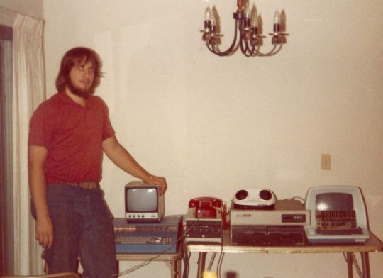
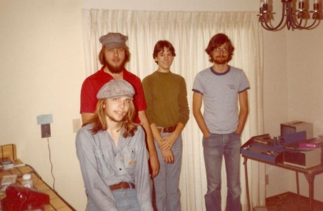

# The History of Rogue

*You see here a +1 history scroll.*

In the fall of 1980, two UC Santa Cruz undergraduates wrote a game in their apartment using a borrowed terminal and a 300-baud modem. The game generated its own dungeon, which meant it could surprise even them. They shared it with the twenty or so friends they figured would play it.

The game was Rogue. The word "roguelike" now appears on hundreds of Steam titles. The @ sign is still descending.

This document draws primarily on Glenn Wichman's own [account](https://web.archive.org/web/20070622153327/http://www.wichman.org/roguehistory.html), supplemented by interviews and historical sources cited throughout.

---

## 1978

Some background for anyone who wasn't around computers in 1980. The main home computers were the [Atari 400/800](https://en.wikipedia.org/wiki/Atari_8-bit_family), the [Commodore 64](https://en.wikipedia.org/wiki/Commodore_64), and the [Apple II](https://en.wikipedia.org/wiki/Apple_II). No Macintosh. Hardly any IBM PCs. At university computer labs, students used dumb terminals connected to minicomputers or mainframes. The terminals had no graphics. Programs output text, which scrolled off the screen and was gone.

> Even though the terminals had a screen like a TV screen, they were based on the earlier technology of paper printers, so you did not treat the screen as an integrated output device, you treated it as if it were a printer, you would just send text to the output and it would appear at the bottom of the screen and everything else would scroll up; once it scrolled off the top of the screen it was gone forever.
>
> -- Glenn Wichman, [Spillhistorie.no interview (2024)](https://spillhistorie.no/2024/07/14/the-story-of-rogue/)

A popular game on college computers was [Adventure](https://en.wikipedia.org/wiki/Colossal_Cave_Adventure) (also known as Colossal Cave): a text-only game where the computer described your surroundings and you typed commands like "go west" or "pick up bird."

---

## Two Freshmen in Santa Cruz

Glenn Wichman and Michael Toy met as freshmen at [UC Santa Cruz](https://en.wikipedia.org/wiki/University_of_California,_Santa_Cruz) in 1978. Wichman wanted to be a game designer, by which he meant board games. When he got to college he discovered Adventure, taught himself BASIC, and started writing a text adventure.

> One day while struggling with getting it to work, a tall stranger came up and asked me what I was working on, and that turned out to be Michael Toy. He knew much more about computers and programming than I did, and had also made several games, so he helped me debug my game.
>
> -- Glenn Wichman, [Spillhistorie.no interview (2024)](https://spillhistorie.no/2024/07/14/the-story-of-rogue/)

From then on they played each other's games. It was never any fun to play your own text adventure, of course, because you already knew all the answers.

The university had a [DEC VAX 11/780](https://en.wikipedia.org/wiki/VAX-11) that all users shared. Wichman [never even saw the machine](https://spillhistorie.no/2024/07/14/the-story-of-rogue/). It was underground, a kilometer away. Everyone worked on terminals. Toy and Wichman set up an [ADM-3a](https://en.wikipedia.org/wiki/ADM-3A) in their apartment and used a 300-baud modem to dial into the VAX. Most of Rogue was written from there.

---

## Curses

Meanwhile, 120 kilometers away at [UC Berkeley](https://en.wikipedia.org/wiki/University_of_California,_Berkeley), [Bill Joy](https://en.wikipedia.org/wiki/Bill_Joy) had written [vi](https://en.wikipedia.org/wiki/Vi_(text_editor)), a visual editor that worked on any terminal by maintaining a database of terminal escape codes. A Berkeley student named [Ken Arnold](https://en.wikipedia.org/wiki/Ken_Arnold) extracted the cursor-handling code from vi and turned it into a general-purpose library called [curses](https://en.wikipedia.org/wiki/Curses_(programming_library)). Any C program could now treat a terminal as an addressable grid.

> Michael got ahold of this library and we both started using it to make simple graphical games, and then Michael asked me if I thought it would be possible to use this to make a graphical Adventure game. I didn't think it would be possible but as we began to talk about it more we realized that not only could we make an adventure game with this, but we could make one where the computer itself created the environment you were exploring, we could create a game that could surprise even its creators, and that was the beginning of Rogue.
>
> -- Glenn Wichman, [Spillhistorie.no interview (2024)](https://spillhistorie.no/2024/07/14/the-story-of-rogue/)

---

## Making Rogue

The first version was written in the fall of 1980. Wichman was a novice C programmer, so Toy did most of the coding. Wichman [pretty much learned C by looking over his shoulder](https://web.archive.org/web/20070622153327/http://www.wichman.org/roguehistory.html). The ideas came from both of them. The name was [Wichman's](https://web.archive.org/web/20070622153327/http://www.wichman.org/roguehistory.html).

The main inspiration was [Dungeons & Dragons](https://en.wikipedia.org/wiki/Dungeons_%26_Dragons). Early versions had monster stats copied straight from D&D. The player character was named Rodney, envisioned as [kind of a goofy loser, not a brave warrior](https://en.wikipedia.org/wiki/Rogue_(video_game)). The Amulet of Yendor is "Rodney" spelled backward.

The game had 26 monster types (one per capital letter), 26 dungeon levels, and permadeath. No save-scumming. The dungeon was different every time.

> We knew that our game was more fun, imaginative, and engaging than anything else running on the college computers. We saw our friends scream and pound the keyboard when killed by a troll, or stand up and dance when they found the amulet. And we had those same reactions ourselves, playing our own game.
>
> -- Glenn Wichman, [Spillhistorie.no interview (2024)](https://spillhistorie.no/2024/07/14/the-story-of-rogue/)

They shared it with about twenty friends. That was the intended audience.

> I think we knew we had something special from the start. But also we didn't have an idea of what "big" was at that time. We were creating a game to play with our friends and didn't really think beyond the 20 or so people we knew who would play it with us.
>
> -- Glenn Wichman, [Spillhistorie.no interview (2024)](https://spillhistorie.no/2024/07/14/the-story-of-rogue/)

---

## Berkeley

They had a playable game, without all the features yet (no armor, for instance), when Toy transferred to UC Berkeley. Around 1982, his attention to Rogue [caused him to suffer poor academic performance](https://en.wikipedia.org/wiki/Rogue_(video_game)). He was kicked out of school, then got a job at Berkeley's computer lab. He took the code with him.

For a while both maintained their own versions, Toy in Berkeley and Wichman in Santa Cruz. This didn't work. Wichman let Toy take over. At Berkeley, Toy connected with Ken Arnold, the creator of curses, who had become a fan. Arnold's library was so closely associated with the game that [many thought curses had been written for Rogue](https://spillhistorie.no/2024/07/14/the-story-of-rogue/).

> Michael and I worked on it for months and then Michael moved to U.C. Berkeley and then I was out of the picture for a while, but Ken Arnold joined in and the game was completed by the two of them.
>
> -- Glenn Wichman, [Spillhistorie.no interview (2024)](https://spillhistorie.no/2024/07/14/the-story-of-rogue/)

---

## BSD Unix

UC Berkeley was the home of [BSD Unix](https://en.wikipedia.org/wiki/Berkeley_Software_Distribution), the most widely used version of Unix in academia. Rogue was included in the [4.2 BSD](https://en.wikipedia.org/wiki/History_of_the_Berkeley_Software_Distribution) distribution. This put it on university computers everywhere.

> Rogue became widely known when it was included as part of the Berkeley UNIX standard distribution... most of the games included with the distribution were mild diversions, and none of them were graphical in nature. Rogue was among the very first games to treat a text-based terminal as a graphic canvas by using ASCII "art," which made the game much more visually interesting.
>
> -- Glenn Wichman, [Spillhistorie.no interview (2024)](https://spillhistorie.no/2024/07/14/the-story-of-rogue/)

Wichman's analysis of why the game held up:

> Rogue was also a very well balanced game. It was notoriously hard to beat, but you did not have to beat it to enjoy it. It was easy to learn and understand. The world was rich enough to surprise you, but it was not overwhelming... a single explorer, no classes or races or other complexities to set up your character, you could just start playing. 26 monster types total, large enough to keep the game fresh and interesting but small enough that you could keep it all in your head without having to refer to a monster manual.
>
> -- Glenn Wichman, [Spillhistorie.no interview (2024)](https://spillhistorie.no/2024/07/14/the-story-of-rogue/)

Over the next three years Rogue became, by Wichman's account, the [most popular game on college campuses](https://web.archive.org/web/20070622153327/http://www.wichman.org/roguehistory.html).

---

## Version 3.6

[Rogue 3.6](https://rlgallery.org/about/rogue3.html), released in April 1981, ran under early BSD Unix on the [PDP-11](https://en.wikipedia.org/wiki/PDP-11). Copies began appearing in the [2BSD](https://en.wikipedia.org/wiki/History_of_the_Berkeley_Software_Distribution#2BSD_(PDP-11)) software collection.

The authors kept tight control of the source code, mostly to prevent cheating. But sometime around June 1981, somebody got hold of a copy anyway. That leaked code became the ancestor of [Super-Rogue](https://en.wikipedia.org/wiki/Super-Rogue), [Advanced Rogue](https://en.wikipedia.org/wiki/Advanced_Rogue), and the other early roguelikes, including Jay Fenlason's [Hack](../hack/HISTORY.md) (1982), which eventually became [NetHack](https://en.wikipedia.org/wiki/NetHack).

---

## Going Commercial

After leaving school, Toy got a job at [Olivetti](https://en.wikipedia.org/wiki/Olivetti) in Italy. There he met **Jon Lane**, a system administrator who played Rogue and was convinced it could sell in the home market. They founded **A.I. Design** and ported the game to the [IBM PC](https://en.wikipedia.org/wiki/IBM_Personal_Computer).

Lane used the PC's [Code page 437](https://en.wikipedia.org/wiki/Code_page_437) character set to expand the visual symbols. The player character became a happy face. They funded publishing themselves at first but could only break even.

The game company [Epyx](https://en.wikipedia.org/wiki/Epyx) took over marketing. A.I. Design produced versions for several platforms: Toy wrote the [Amiga](https://en.wikipedia.org/wiki/Amiga) version, Wichman wrote the [Atari ST](https://en.wikipedia.org/wiki/Atari_ST) version (with graphics by Epyx's Michael Kosaka), and Wichman did the graphic design for the [Macintosh](https://en.wikipedia.org/wiki/Macintosh) version in exchange for a used Mac.

It didn't work out. Epyx went bankrupt. The Atari ST and Amiga faded. Wichman was [paid $15,000 for the Atari ST work](https://spillhistorie.no/2024/07/14/the-story-of-rogue/). That was all the money he ever made from Rogue.

> Even though Rogue was way ahead of its time in 1980, by the time we did the commercial version in 1984, the expectations of what a computer game should do had changed drastically, and we really never sat down and said, "What does Rogue need to be in order to compete in today's marketplace?"
>
> -- Glenn Wichman, [Spillhistorie.no interview (2024)](https://spillhistorie.no/2024/07/14/the-story-of-rogue/)

---

## The Name

The term "roguelike" became [official around 1993](https://en.wikipedia.org/wiki/Roguelike). Usenet needed a category name for the `rec.games.roguelike.*` hierarchy. After some discussion, the term stuck.

> I just feel incredibly lucky that it happened to catch on. Most genres don't get named after the first major example of the genre, and if the name had not been "Roguelike," I don't know if Rogue would be remembered nearly as well as it has been.
>
> -- Glenn Wichman, [Spillhistorie.no interview (2024)](https://spillhistorie.no/2024/07/14/the-story-of-rogue/)

---

## Wisdom

Wichman has never beaten the game himself. He has noticed something about the people who do:

> The people who do beat Rogue never ever hit a key twice in a row without waiting to see the consequences of the previous move, reevaluate, and calculate. You need a good strategy of course but you need to treat it as a turn-based puzzle game to survive. I always got lost in the feeling of being in that world and I never had the patience to stop and think after every move.
>
> -- Glenn Wichman, [Spillhistorie.no interview (2024)](https://spillhistorie.no/2024/07/14/the-story-of-rogue/)

And:

> Hitting the keys harder will not do more damage.

---

## After Rogue

### Glenn Wichman

After A.I. Design, Wichman worked at [Software Toolworks](https://en.wikipedia.org/wiki/The_Learning_Company#Mindscape) in LA on several games, the best known being [Mavis Beacon Teaches Typing](https://en.wikipedia.org/wiki/Mavis_Beacon_Teaches_Typing). He spent five years at [Intuit](https://en.wikipedia.org/wiki/Intuit) managing the Macintosh team for [Quicken](https://en.wikipedia.org/wiki/Quicken) and made Mac shareware games [Toxic Ravine and Mombasa](https://web.archive.org/web/20070622153327/http://www.wichman.org/roguehistory.html). In 2010 he joined [Zynga](https://en.wikipedia.org/wiki/Zynga) as a principal developer. He reconnected with the roguelike community around 2011 and has been a regular at events like [Roguelike Celebration](https://roguelike.club/).

### Michael Toy

After A.I. Design, Toy worked at [SGI](https://en.wikipedia.org/wiki/Silicon_Graphics) and followed its founder [Jim Clark](https://en.wikipedia.org/wiki/James_H._Clark) to [Netscape](https://en.wikipedia.org/wiki/Netscape), where he served as launch lead for the browser. He appears in [*Code Rush*](https://en.wikipedia.org/wiki/Code_Rush), the documentary about the Mozilla source code release. He later joined [Mitch Kapor](https://en.wikipedia.org/wiki/Mitch_Kapor)'s [OSAF](https://en.wikipedia.org/wiki/Open_Source_Applications_Foundation) in 2003 as the first development manager for the [Chandler](https://en.wikipedia.org/wiki/Chandler_(software)) project.

### Ken Arnold

[Kenneth C. R. C. Arnold](https://en.wikipedia.org/wiki/Ken_Arnold) (born 1958) received his BA in computer science from UC Berkeley in 1985. He was president of the Berkeley Computer Club and contributed to both 2BSD and 4BSD. After curses and Rogue, he went to [Sun Microsystems](https://en.wikipedia.org/wiki/Sun_Microsystems), where he was one of the architects of [Jini](https://en.wikipedia.org/wiki/Jini), the main implementer of [JavaSpaces](https://en.wikipedia.org/wiki/JavaSpaces), and co-author (with [James Gosling](https://en.wikipedia.org/wiki/James_Gosling)) of [*The Java Programming Language*](https://en.wikipedia.org/wiki/The_Java_Programming_Language).

### Jon Lane

Jon Lane continued to run his own small company, [The Code Dogs](https://web.archive.org/web/20070622153327/http://www.wichman.org/roguehistory.html).

---

## From Rogue to Hack to NetHack

The source code leak around June 1981 set off a chain reaction. At [Lincoln-Sudbury Regional High School](https://en.wikipedia.org/wiki/Lincoln-Sudbury_Regional_High_School) in Massachusetts, a junior named [Jay Fenlason](../hack/HISTORY.md) wrote [Hack](https://en.wikipedia.org/wiki/Hack_(video_game)) in 1982. It had more monsters, more items, and a persistent dungeon. Hack spread through Usenet, was substantially rewritten by [Andries Brouwer](https://en.wikipedia.org/wiki/Andries_Brouwer) in the Netherlands, and went out as Hack 1.0 in December 1984. The traffic was so heavy that [Gene Spafford](https://en.wikipedia.org/wiki/Gene_Spafford) had to create a dedicated newsgroup.

[Mike Stephenson](https://nethackwiki.com/wiki/Mike_Stephenson) merged several Hack variants and published [NetHack](https://en.wikipedia.org/wiki/NetHack) in July 1987.

**Rogue (1980) -> Hack (1982) -> NetHack (1987)**. This project, [Mazes of Menace](https://mazesofmenace.net/), is a JavaScript port of NetHack. It sits alongside a [browser port of the original 1982 Hack](../hack/), bringing the full family tree into the browser.

---

## Sources

### Primary Accounts
- Glenn Wichman, ["A Brief History of Rogue"](https://web.archive.org/web/20070622153327/http://www.wichman.org/roguehistory.html) (1997, via Wayback Machine)
- Glenn Wichman, ["Rogue Stories"](https://web.archive.org/web/20070622153512/http://www.wichman.org/roguestories.html) (fan letters, via Wayback Machine)
- Joachim Froholt, ["The Story of Rogue"](https://spillhistorie.no/2024/07/14/the-story-of-rogue/) -- interview with Glenn Wichman (Spillhistorie.no, 2024)
- Gamereactor, ["40 Years On: The Making of Rogue with Glenn Wichman"](https://www.gamereactor.eu/40-years-on-the-making-of-rogue-with-glenn-wichman/)

### Technical History
- Roguelike Gallery, ["Rogue V3: Development History"](https://rlgallery.org/about/rogue3.html)
- Wikipedia, ["Rogue (video game)"](https://en.wikipedia.org/wiki/Rogue_(video_game))
- Wikipedia, ["Curses (programming library)"](https://en.wikipedia.org/wiki/Curses_(programming_library))
- IEEE-USA InSight, ["Going Rogue: A Brief History of the Computerized Dungeon Crawl"](https://insight.ieeeusa.org/articles/going-rogue-a-brief-history-of-the-computerized-dungeon-crawl/)

### Biographical
- Wikipedia, ["Ken Arnold"](https://en.wikipedia.org/wiki/Ken_Arnold)
- Wikipedia, ["Glenn Wichman"](https://en.wikipedia.org/wiki/Glenn_Wichman)
- en-academic.com, ["Michael Toy"](https://en-academic.com/dic.nsf/enwiki/2832054)
- Wikipedia, ["Code Rush"](https://en.wikipedia.org/wiki/Code_Rush)
- Roguelike Celebration, ["Rogue Panel" (2016)](https://www.youtube.com/watch?v=4IkrZkUV01I) -- Toy, Wichman, and Arnold together on stage

### The Descendants
- [Hack HISTORY.md](../hack/HISTORY.md) -- Jay Fenlason's 1982 Hack
- Wikipedia, ["NetHack"](https://en.wikipedia.org/wiki/NetHack)
- The Rogue Archive, [britzl.github.io/roguearchive](https://britzl.github.io/roguearchive/)
